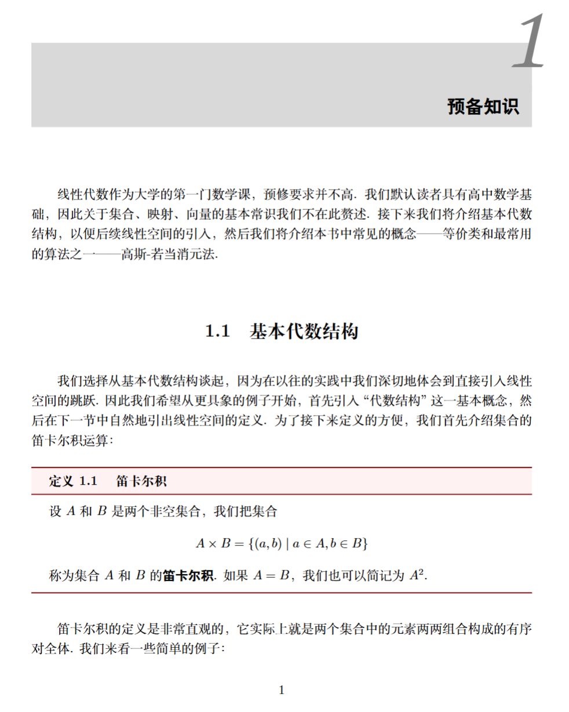
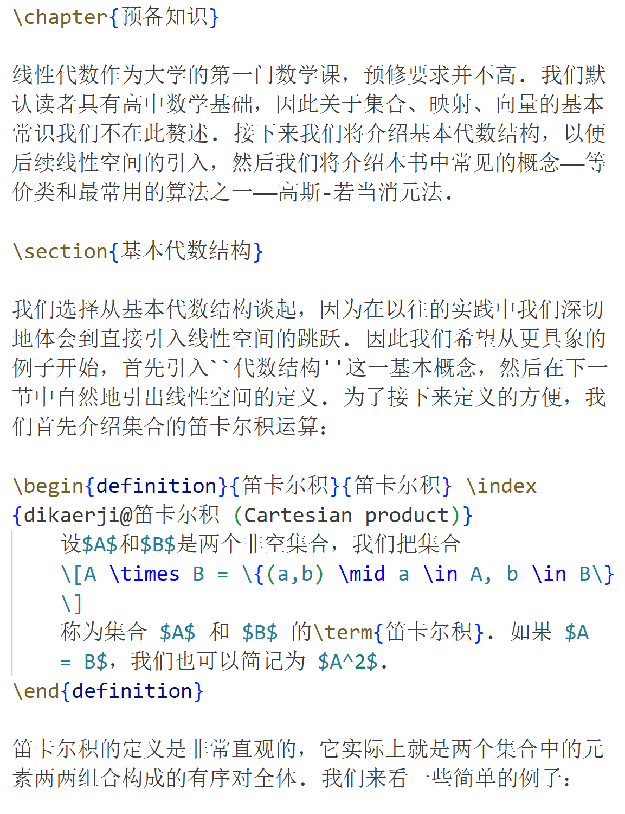
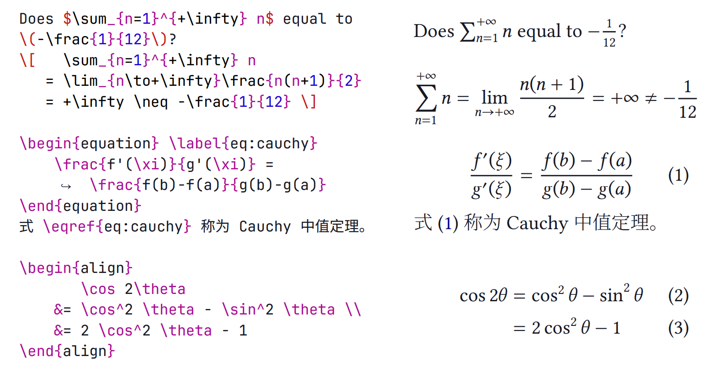
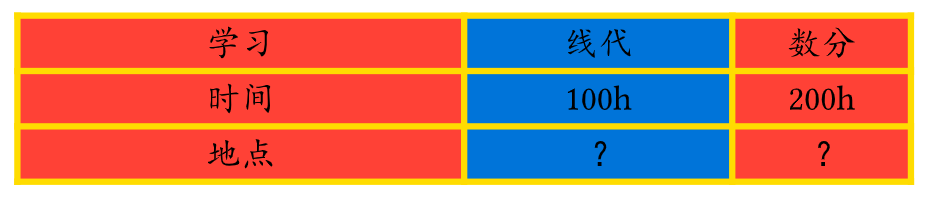

<div class="middle center">
<div style="width: 100%">

# 实验文档写作与排版

<hr/>

2025/12/14

</div>
</div>

<!--v-->

## 内容概览
- Markdown 的本质是什么？
- Latex 
- Typst 写作指南

<!--v-->

## 开始之前
- vscode 安装插件 
  + Markdown All in One
  + Markdown Preview Enhanced

<!--s-->


<div class="middle center">
<div style="width: 100%">

# Part.1-1 Markdown 语法概览

Markdown 语法存在微小差异

</div>
</div>

<!--v-->


## 标题

<div class="mul-cols">
<div class="col">

- 井号 # 开头，后接内容
- 井号与标题间至少一个空格
- 只有 1～6 级标题，7 及以上不会变成标题格式

</div>

<div class="col">

```markdown
# 一级标题
## 二级标题
### 三级标题
#### 四级标题
##### 五级标题
###### 六级标题
```

</div>

</div>

<!--v-->

## 引言

<div class="mul-cols">
<div class="col">

- 一个 > 加一个空格后接内容
- 内部可以嵌套使用 markdown 语法
    - 可以嵌套任意多层引言
- 连续的 > 行属于同一个引言块
- 需要一个空行来退出环境

</div>
<div class="col">

```markdown
> ## Quote
> 第二行
> > 第二层
> 
> 回到第一层

退出引言
```

</div>

</div>

<!--v-->


## 无序列表

<div class="mul-cols">
<div class="col">

- `- + *` 后接一个空格然后接内容
- 同一个层级的符号要相同
- 如果一个项中要包含内容，换行输入即可
- 嵌套列表直接缩进一次即可

</div>
<div class="col">

```markdown
- node 1
- node 2
content in node 2
- node 3

* 第一层
    + 第二层
        * 第三层
    + 第二层
* 第一层
```

</div>
</div>

<!--v-->


## 有序列表

<div class="mul-cols">
<div class="col">

- 数字加点 后接空格 再接内容
    - 也可以数字加 ) 后接空格 再接内容
- 标准的 md 完全无视数字内容，所有有序列表都从 1 开始计数
- 但一般软件都会处理起始数字
- 有序列表可以和无序列表互相嵌套

</div>
<div class="col">

```markdown
1. node 1
2. node 2
4. node 3
1. node 4

1. 有序 
    - 嵌套无序
    - 嵌套无序
2. 有序
```

</div>

</div>

<!--v-->


## 分割线

<div class="mul-cols">
<div class="col">

- 使用 `* - _` 中任意一个字符重复至少三次
- 可以有空格分隔，甚至组织成不同样式
- 被转换为 html 中的 \<hr/>
- 分割线上下最好都加空行
- 特别记住 - 分割线上方不要有文字（空行即可）

</div>
<div class="col">

```text
***

* * *
_  __  _  __

----------------
```

</div>

</div>

<!--v-->


## 代码块

<div class="mul-cols">
<div class="col">

- 行内两个单 ` 包裹
- 缩进形式
    - 空行加一个缩进创建一个代码块
    - 内部被原样展现
    - 软件不会进行代码高亮
- 篱笆形式
    - 使用三个或以上 ` 或 ~ 围起来构成代码块
    - ` 或 ~ 后面可以加语言名
        - 带有高亮支持的软件会对其进行高亮显示

</div>
<div class="col">

~~~markdown
`#include<stdio.h>`

code block:

    print("hello world")
    # line 2

out

```c
#include <stdio.h>

int main() {
    printf("hello world\n");
    return 0;
}
```
~~~

</div>

</div>

<!--v-->


## 行内标记

<div class="mul-cols">
<div class="col">

- 格式见右侧，* 和 _ 等效
- 行内标记都可以互相嵌套
    - 也可以嵌套在其它块中
    - 行内代码中不行
- 文字中使用 * 建议加上 \ 转义

</div>
<div class="col">

```markdown
*斜体* _也是斜体_ \*这不是斜体\*

**粗体** __也是粗体__

***粗斜体*** ___也是粗斜体___

`行内代码`

~~删除线~~
``` 

</div>

</div>

<!--v-->


## 插入图片

<div class="mul-cols">
<div class="col">

- 感叹号-方括号-圆括号结合的形式
- 图片描述可以省略
- 位置可以是链接，也可以是本地文件路径
- 常规 md 语法插入图片无法调大小，使用 html img 的 style 可以调节
- 软件一般可以帮你保存图片到某一目录
- 记住图片不会嵌入 md 文件中，要交给别人 md 文件的话请附带上所有素材文件

</div>
<div class="col">

```markdown


 
```

</div>

</div>

<!--v-->


## 插入链接

<div class="mul-cols">
<div class="col">

- 方括号-圆括号组合
- 文字是要显示的内容，链接附加在其上
- 文字中可以嵌套行内标记格式
- 链接左右加 <> 自动链接

</div>
<div class="col">

```markdown
[文字](链接)

<链接>
等价于 [链接](链接)
```

</div>

</div>


<!--v-->


## 表格

<div class="mul-cols">
<div class="col">

- 不在标准中，但一般这样使用
- 每个单元格的内容用 | 分开
    - 内容中使用 | 要用 \ 转义
- 第二行一定要有，规定整列对齐方式
- 仅可以处理简单表格，复杂的用 html 插入
- 推荐 [tablesgenerator.com](https://www.tablesgenerator.com/)

</div>
<div class="col">

```markdown
|表头|表头|表头|
|:--|:--:|--:|
|居左|居中|居右|
|abcde|fghij|klmno|
|.......|.......|.......|
```

<style>
section > .mul-cols > .col > table {
  border: 1.5pt solid;
  text-align: center;
  page-break-inside: avoid;
}
section > .mul-cols > .col > table > tbody > tr > td {
  border: 0.75pt solid;
  padding: 7px;
}
section > .mul-cols > .col > table > tbody > tr {
  border: 0.75pt solid;
  padding: 7px;
}
section > .mul-cols > .col > table > thead {
  border: 0.75pt solid;
  font-size: 0.9em;
}
section > .mul-cols > .col > table th {
  border: 0.75px solid;
}
</style>

|表头|表头|表头|
|:--|:--:|--:|
|居左|居中|居右|
|abcde|fghij|klmno|
|.......|.......|.......|

</div>

</div>

<!--v-->

## 公式

- 一般使用一对 ```$``` 作为行内公式标记，一对 ```$$``` 作为块级公式标记
- 均使用 LaTeX 公式语法


<!--s-->

<div class="middle center">
<div style="width: 100%">

# Part.1-2 什么是 Markdown

</div>
</div>

<!--v-->


## 什么是 Markdown

- 是一种轻量级文本标记语言
- 可以轻松转换为 HTML（映射到 HTML 的子集）

<div class="mul-cols">
<div class="col">

```markdown
# This is a heading
## This is a sub-heading

This is a paragraph. and:  

- *emphasis* 
- **strong importance**
- `code`
- [links](some/url)
```

</div>

<div class="col">

```html
<h1>This is a heading</h1>
<h2>This is a sub-heading</h2>
<p>This is a paragraph. and:</p>
<ul>
<li><em>emphasis</em></li>
<li><strong>strong importance</strong></li>
<li><code>code</code></li>
<li><a href="some/url">links</a></li>
</ul>
```

</div>

</div>

<!--v-->


## Markdown 是如何到我们看到的文档的

- Markdown $\xrightarrow{\text{解析}} \text{AST} \xrightarrow{\text{渲染}} \text{html} \xrightarrow{\text{浏览器/应用}} \text{CSS 渲染}$

其中最后一步是文档视觉效果的关键


<!--v-->

## 学习用软件

- 裸的 markdown 解析器（如果你熟悉 HTML 语法）
    - [markdown-it](https://github.com/markdown-it/markdown-it)：完美支持 CommonMark 的解析器
    - [markdown-it-py](https://github.com/executablebooks/markdown-it-py)：Python 版本，带有命令行工具
    - [python-markdown](https://github.com/Python-Markdown/markdown/)：更传统的 Python 版本解析器（标准不清晰）
    - [pandoc](https://pandoc.org/)：支持多种格式的转换器，但有自己的一套标准
- 所见即所得的 markdown 编辑器
    - [vscode mpe extension](https://marketplace.visualstudio.com/items?itemName=shd101wyy.markdown-preview-enhanced)：VSCode 的插件，支持实时预览
    - [Mark Text](https://marktext.app/)：开源 markdown 编辑器
    - [obsidian](https://obsidian.md/) 等笔记软件也支持 markdown
    - [Typora](https://typora.io/)：闭源付费编辑器


<!--s-->

<div class="middle center">
<div style="width: 100%">

# Part.2-1 $\LaTeX$ 介绍

</div>
</div>

<!--v-->

## $\LaTeX$ 介绍

- LaTeX 是一个排版系统，主要用于学术论文、技术文档、书籍等高质量排版。它采用“内容与样式分离”的思想，用户只需关注内容，LaTeX 会自动处理排版细节。
- LaTeX 的优点：
  - 排版效果强大，公式排版效果极佳
  - 自动生成目录，图标索引等
  - 稳定性强，适合长期更新的文档，不会因为内容过多卡顿崩溃
- LaTeX 的缺点：
  - 代码较为繁杂，学习成本高
  - 无法实时编辑，不是“所见即所得”
  - 非标准格式调整比较麻烦
  - 不容易 debug

<!--v-->

## $\LaTeX$ 书写工具

- LaTeX 的本地配置时间长步骤多，并不建议在本地配置
  - [一份简短的关于 LaTeX 安装的介绍](https://github.com/OsbertWang/install-latex-guide-zh-cn)

- 更推荐大家使用 Overleaf 进行线上编写
  - [Overleaf（无需科学上网）](https://cn.overleaf.com/)
  - [ZJU Overleaf](https://overleaf.zju.edu.cn/)

<!--v-->

## 开始书写之前

为了书写中文：
1. 打开左上角的菜单，调整编译器为 XeLaTeX，关闭拼写检查
2. 在文档的第二行插入 ```\usepackage[UTF8]{ctex}```

<!--v-->

## LALU


<div class="mul-cols">
<div class="col">



</div>

<div class="col">




</div>

</div>

</div>


<!--s-->

<div class="middle center">
<div style="width: 100%">

# Part.2-2 $\LaTeX$ 语法概览

</div>
</div>

<!--v-->

## 文档结构

```tex
\documentclass{article} % 文档类型声明
% --------- 导言区 --------- %
\usepackage[UTF8]{ctex}
\usepackage{graphicx} 
\title{xxx}
\author{xxx}
\date{xxx}


\begin{document} % 正文开始
% --------- 正文区 --------- %

\maketitle

\section{Introduction}

\end{document} % 文档结束，后续内容不会被编译
```

<!--v-->

## 导言区

- 基础文档类：article、report、book、beamer 等
- 中文变体：ctexart、ctexrep、ctexbook、ctexbeamer 等
- 可以通过可选参数指定字号、纸张大小、双面打印等选项
```tex
\documentclass[12pt,a4paper,twoside]{article}
```
- 宏包加载（功能扩展） `\usepackage`
- 页面布局调整
```tex
\usepackage[top=2cm,bottom=3cm,left=2.5cm,right=2.5cm]{geometry}
\linespread{1.25}             % 1.25 倍行距
\setlength{\parindent}{2pt}   % 首行缩进 2 磅
```
- 标题格式、页眉页脚等等

<!--v-->


## 标题

<div class="mul-cols">
<div class="col">

- 标题会自动编号
- 默认编号深度为 3
- 带星号的代码不会自动编号，也不会出现在目录中
- 目录 `\tableofcontents`
- `\appendix` 起为附录，后续章节编号为大写字母
- 在中间加入[]可以定义目录中的标题

</div>

<div class="col">

```tex
\section{一级标题}
\subsection{二级标题}
\subsubsection{三级标题}

\section*{一级标题}
\section[目录中标题]{文章中标题}

\paragraph{段落标题}
\subparagraph{子段落标题}

% book / report 额外含有
\part{部级标题}
\chapter{章级标题}
```

</div>

</div>


<!--v-->

## 段落

- LaTeX 的段落开头会有缩进，使用 `\noindent` 让这个段落不缩进
- 或者直接在导言区将首行缩进改为 0 长度
- 换行：
  - 分段换行使用 空行 或 `\par`
  - 段内强制换行使用 `\\` 或 `\newline`

<!--v-->


## 环境

<div class="mul-cols">
<div class="col">

- \begin{env}, \end{env} 像一对大括号，包裹一段环境
- env 字段控制这个环境的格式
- 常见的 environment
    - itemize 无序列表
    - enumerate 有序列表
    - table 表格浮动体
    - figure 浮动体
    - tabular 表格
- [表格生成器](https://www.tablesgenerator.com/)


</div>

<div class="col">

```tex
\begin{itemize}
    \item macOS
    \item Windows
    \item Linux
\end{itemize}
```

```
• macOS
• Windows
• Linux
```

</div>

</div>

<!--v-->


## 浮动体

- 用于处理需要灵活定位的图形内容
- [htbp] 代表浮动体的位置优先级
    - here 此处  top 顶部  bottom 底部  page 单页
- 插入图片配合 figure 使用
- 直接粘贴进去即可


```tex
\begin{figure}[htbp]
    \centering
    \includegraphics[width=1\linewidth]{image.png}
    \caption{Enter Caption} % 图片名称
    \label{fig:placeholder} % 引用名称
\end{figure}
```

<!--v-->


## 关于图片补充

- 需要 graphicx 宏包（新建时自带）
- \includegraphics[options]{filename}
  - 常用选项：width、height、scale 宽高缩放
  - filename 可以是相对路径或绝对路径

<!--v-->


## 数学公式



<!--v-->
## 数学公式

- 行内公式使用 `$`...`$` 或 `\(`...`\)`
- 行间公式
  - 单行公式用 `\[`...`\]`
  - 多行公式用 equation / align / gather 等环境
  - 不要用双`$`：TEX 原始语法，会产生很多问题
  
<!--s-->

<div class="middle center">
<div style="width: 100%">

# Part.3-1 Typst 介绍  

</div>
</div>

<!--v-->

## Typst 介绍

Typst 是一个现代化的专业排版系统，它结合了：
- LaTeX 的排版能力（复杂数学公式、精细排版）
- Markdown 的简洁语法（易学易写，减少样板代码）
- 现代编程语言特性

Typst 的优点：
- 语法简洁易学，通过简单标记就可实现复杂排版
- 编译速度极快，可以实时预览
- 轻量化且可扩展

<!--v-->

## 开始之前

- vscode 安装插件
  - Tinymist Typst

- 在线编辑工具
  - [官方的 webapp](https://typst.app/)

<!--s-->

<div class="middle center">
<div style="width: 100%">

# Part.3-2 Typst 标记语法概览  

</div>
</div>

<!--v-->

## 换行

- 分段换行使用 空行
- 段内换行使用转义空格或者转义换行
  - 转义字符 '\\'


<!--v-->


## 标题

<div class="mul-cols">
<div class="col">

- '=' 开头，后接内容
- '=' 与标题间至少一个空格
- '=' 字符的数量决定了标题的嵌套级别

</div>

<div class="col">

```typ
= 一级标题
== 二级标题
```

</div>

</div>

<!--v-->


## 无序列表

<div class="mul-cols">
<div class="col">

- `-` 后接一个空格然后接内容
- 如果一个项中要包含内容，先换行 '\\' 再缩进书写
- 嵌套列表直接缩进一次即可

</div>
<div class="col">

```typ
- node 1
- node 2\
 content in node 2
- node 3

- 第一层
    - 第二层
        - 第三层
    - 第二层
- 第一层
```

</div>
</div>

<!--v-->


## 有序列表

<div class="mul-cols">
<div class="col">

- `+` 后接一个空格然后接内容
- 如果一个项中要包含内容，先换行 '\\' 再缩进书写
- 嵌套列表直接缩进一次即可
- 有序列表可以和无序列表互相嵌套

</div>
<div class="col">

```typ
+ node 1
+ node 2
+ node 3
+ node 4

+ 有序 
    - 嵌套无序
    - 嵌套无序
+ 有序
```

</div>

</div>

<!--v-->

## 代码块

<div class="mul-cols">
<div class="col">

- 使用三个或以上 ` 围起来构成代码块
- 前后的 ` 数量要求一致
- ` 后面可以加语言名
    - 带有高亮支持的软件会对其进行高亮显示

</div>
<div class="col">

~~~markdown
```c
#include <stdio.h>

int main() {
    printf("hello world\n");
    return 0;
}
```
~~~

</div>

</div>

<!--v-->


## 行内标记

<div class="mul-cols">
<div class="col">

- 两个 * 中间部分为粗体
- 两个 _ 中间部分为斜体
- 行内标记都可以互相嵌套
    - 也可以嵌套在其它块中
    - 行内代码中不行
- 目前仅支持英文
</div>
<div class="col">

```txt
_斜体_

*粗体* 

*_粗斜体_* _*粗斜体*_

`行内代码`

``` 

</div>

</div>

<!--v-->


## 速记符号

- 一些符号需要用特殊的符号组合打出
    - 空格：~
    - 连接号：--
    - 省略号：...
- [完整列表](https://typst.app/docs/reference/symbols/)


<!--v-->

## 注释

<div class="mul-cols">
<div class="col">

- // 注释本行往后所有内容
- /*  */ 注释中间内容
</div>
<div class="col">

```c
// 这是注释

/* 这也是注释 */

``` 

</div>

</div>

<!--v-->

## 数学公式

- 行内数学公式：两个 \$ 两内侧不加空格
- 行间数学公式：两个 \$ 两内侧各加一个空格

```typ
行内数学公式：$sum_x$
行间数学公式：$ sum_x $
```
<!--s-->

<div class="middle center">
<div style="width: 100%">

# Part.3-3 Typst 脚本语法概览  

</div>
</div>

<!--v-->

## 脚本模式

- \# 使解释器进入 脚本模式
- 可以想象成写代码，它可以返回代码的值
- Typst 是一个动态解释器，其按顺序查看并解释你的文档源码。
- 而 # 号就是告诉这个当前处于标记模式的解释器，接下来转为脚本模式
- 当处于脚本模式时，解释器在适当的时候从脚本模式退回为标记模式
- Typst 总是倾向于更快地退出脚本模式
- 一对 方括号 [] 可以暂时回到标记模式
<!--v-->

## 函数 (text 为例)

- 直接写的所有文本都是 text

```typ
#text[Typst is interesting !]

#text(fill: blue, size: 20pt, font: "Consolas")[Typst is interesting !]
```

```typ
#set text(fill: blue, size: 20pt, font: "Consolas")

Typst is interesting !
```

<!--v-->
## 变量与函数

<div class="mul-cols">
<div class="col">

- let 可以定义变量
  - 变量也可以再次赋值
- 也可以定义函数

</div>
<div class="col">

```typ
#let x = "哈基米"; 
#x

#let y = "南北绿豆"; 
#y

#let f(x,y) = [#(x)哦#(y)];

#f(x,y);
```

```txt
哈基米
南北绿豆
哈基米哦南北绿豆
```

</div>

</div>

<!--v-->
## 变量与函数

<div class="mul-cols">
<div class="col">

- 稍微复杂一点
- 可以封装常用的样式

</div>
<div class="col">

```typ
#let exercise(question, answer) = {
  text(
    font: "KaiTi",
    size: 14pt,
    weight: "bold",
  )[Q: #question]
  [\ ]
  text(
    font: "FangSong", 
    size: 12pt,
    {"A: " + answer}
  )
}

#exercise(
  [请问Typst中有几个字母],
  [五个]
)

```

</div>

</div>

<!--v-->

## 图片

<div class="mul-cols">
<div class="col">

- image 函数，常用参数：
  - height / width
  - fit 图片比例
- 使用时直接粘贴图片即可

</div>
<div class="col">

```typ
#image("assets/image-1.png", 
  height: 12cm, 
  width: 6cm, 
  fit: cover
)
```

</div>
</div>

<!--v-->

## 表格

<div class="mul-cols">
<div class="col">

- table 函数，常用参数：
  - columns 列宽
  - stroke 边框
  - align 文字位置
</div>
<div class="col">

```typ
#table(
  columns: (5cm,3cm,2cm), 
  stroke: 2pt + yellow,
  align: center, 
  fill: (red, blue),
  
  [学习], [线代], [数分],
  [时间], [100h], [200h],
  [地点], [？], [？],
)

columns: (5cm,1fr,2fr),
```

</div>
</div>

<!--v-->

## 位置函数

- align 函数，常用参数：
  - left, center, right, top, horizon, bottom

```typ
#align((left, top))[
    内容
]
```
</div>
</div>

<!--v-->

## 二维布局函数

<div class="mul-cols">
<div class="col">

- grid 可以将元素进行二维布局
- 如何将右边的半圆和上张ppt中的表格并排放置
</div>
<div class="col">

```typ
#align(center)[
  #curve(
    fill: blue.lighten(80%),
    stroke: blue,
    curve.move((0pt, 50pt)),
    curve.line((100pt, 50pt)),
    curve.cubic(none, (90pt, 0pt), (50pt, 0pt)),
    curve.close(),
  ),
]
```

</div>
</div>

<!--v-->
```typ
#grid(
  columns: (1fr, 1fr),
  align(center)[
    #curve(
      fill: blue.lighten(80%),
      stroke: blue,
      curve.move((0pt, 50pt)),
      curve.line((100pt, 50pt)),
      curve.cubic(none, (90pt, 0pt), (50pt, 0pt)),
      curve.close(),
    ),
  ],
  table(
    columns: (5cm,3cm,2cm), 
    stroke: 2pt + yellow,
    align: center, 
    fill: (red, blue),
    [学习], [线代], [数分],
    [时间], [100h], [200h],
    [地点], [？], [？]
  )
)
```

<!--v-->

## 链接

- link(url, content)

```typ
#link("https://typst.app", [Typst.app])
```

<!--s-->

<div class="middle center">
<div style="width: 100%">

# Part.4 如何进一步学习 & 可以做什么  

</div>
</div>

<!--v-->

## 如何进一步学习

- Markdown
  - [Markdown 中文教程](https://markdown.com.cn/)
  - [Markdown CommonMark 标准文档](https://spec.commonmark.org/)
- LaTeX
  - [一份（不太）简短的 $\LaTeX \ 2_𝜀$ 介绍](https://github.com/CTeX-org/lshort-zh-cn)
  - [$\LaTeX$ Wikibook](https://en.wikibooks.org/wiki/LaTeX)
- Typst
  - [Typst 中文文档](https://typst-doc-cn.github.io/docs/)
  - [Typst 中文教程](https://typst-doc-cn.github.io/tutorial/)
  - [官方英文文档](https://typst.app/docs/)

<!--v-->

## 可以做什么 - Markdown

- 个人博客：Hexo
  - [Hexo 官方文档](https://hexo.io/zh-cn/docs/)
- 笔记本：Mkdocs
  - [Mkdocs 官方文档](https://www.mkdocs.org/)
- 制作 slides
  - [Reveal-md](https://github.com/webpro/reveal-md)
- 日常记笔记
- 简单的 report 书写

<!--v-->
## 可以做什么 - LaTeX & Typst

- LaTeX
  - 科研论文
  - 制作 slides：Beamer
  - 制作简历
- Typst
  - 有格式要求的论文书写
- LaTeX 和 Typst 的相关模板可以在 cc98 上进行搜索
