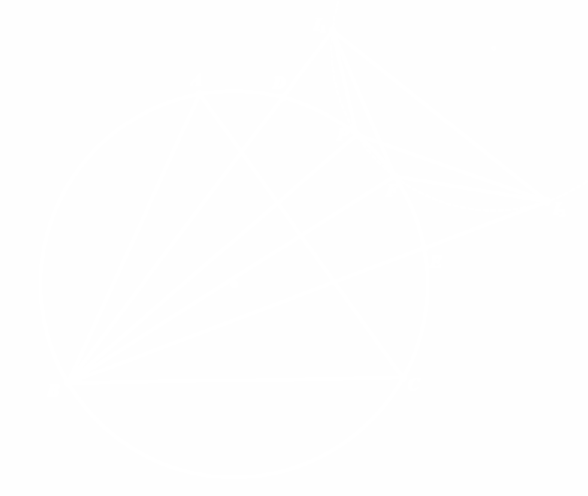

<audio id="audio1">
    <source src="test/audio1.mp3" type="audio/mpeg">
    Your browser does not support the audio element.
</audio>
<audio id="audio2">
    <source src="test/audio2.mp3" type="audio/mpeg">
    Your browser does not support the audio element.
</audio>

<!-- .slide: data-background="test/cover.png" -->

<div class="middle center">
<div style="width: 100%">

<h1 onclick="document.getElementById('audio1').play()">いらっしゃいませ!</h1>
<!-- <h1 onclick="alert(1)">いらっしゃいませ!</h1> -->


</div></div>

<!--v-->
<!-- .slide: data-background="test/background.webp" -->

## 关于封面

只是测试罢了（

- 虽然但是，关注茜特拉莉谢谢喵~

<div style="text-align: center; zoom: 1.1;">
<iframe id="ytplayer" type="text/html" width="640" height="360"
  src="https://www.youtube.com/embed/Yz9q5yKhpOM"
  frameborder="0"></iframe>
</div>

<!--s-->
<!-- .slide: data-background="test/background.webp" -->

<div class="middle center">
<div style="width: 100%">

# Part.1 标题测试

</div></div>

<!--v-->
<!-- .slide: data-background="test/background.webp" -->

## Quote测试

<style>
.reveal blockquote {
    width: 90%;
}
.reveal blockquote p {
    font-size: 0.5em;
}
</style>

> <a href="https://ciallo.cc" class="hiddenlink">Ciallo～(∠・ω<)⌒★</a>
> &emsp;&emsp;&emsp;&emsp;&emsp;&emsp;&emsp;&emsp;&emsp;&emsp;&emsp;&emsp;&emsp;&emsp;&emsp;&emsp;&emsp;&emsp;&emsp;&emsp;&emsp;&emsp;&emsp;&emsp;&emsp;&emsp;&emsp;&emsp;&emsp;&emsp;&emsp;&emsp;—— 因幡めぐる

### 图片测试

<div style="text-align: center; margin-top: 0px; margin-bottom: 0px">

</div>

<!--v-->
<!-- .slide: data-background="test/background.webp" -->

## 代码测试

- 行内代码：`printf("helloworld");`
- 行间代码：
```python
# 一个实现deepseek（简易版）的Python代码
import time
while (0 or 1=1):
    input("请输入文本")
    time.sleep(10)
    print("服务器繁忙，请稍后再试")
```

<!--v-->
<!-- .slide: data-background="test/background.webp" -->

## 数学测试

- 行内环境：$\displaystyle \sum_{i=0}^{\infty} \dfrac{(-1)^i}{i!}=\dfrac{1}{e}.$
- 行间环境：$$ \dfrac{P A \cdot B C}{\sin(\angle B P C-\angle B A C)}=\dfrac{P B \cdot A C}{\sin(\angle A P C-\angle A B C)} $$ 且该式子对于$\triangle{ABC}$轮换对称成立.

<!--s-->
<!-- .slide: data-background="test/background.webp" -->

<div class="middle center">
<div style="width: 100%">

<h1 onclick="document.getElementById('audio2').play()">よろしくお願いします!</h1>

</div></div>